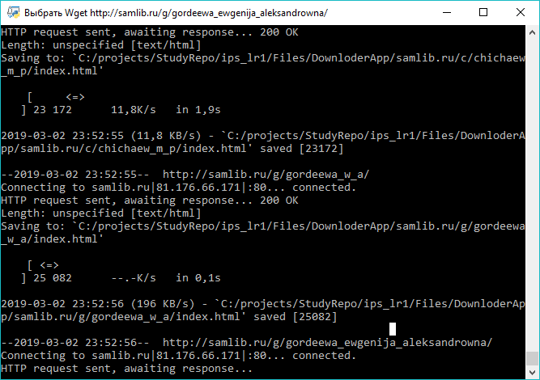
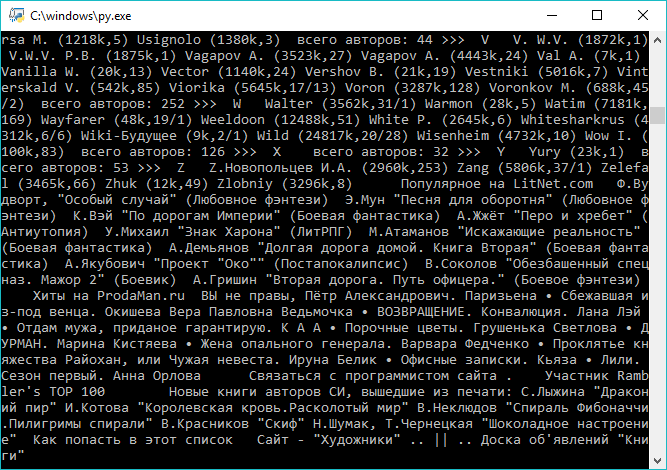
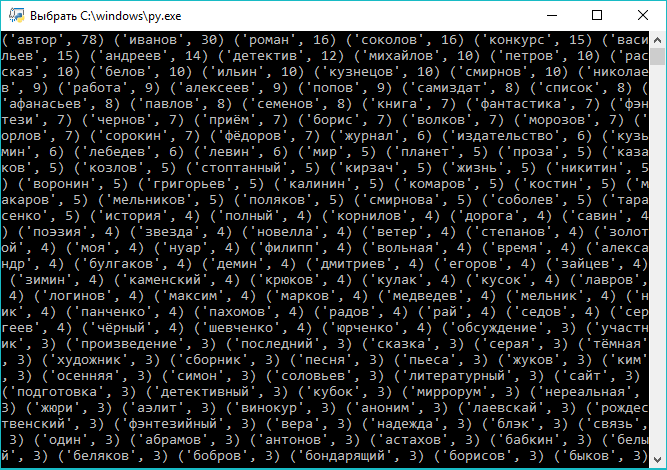

# Построение полнотекстового индекса

## Постановка задачи

Построение полнотекстового индекса для сайта http://samlib.ru/.
Индекс должен содержать поля «автор», «персонажи», «места» и собственно слова текста.

Задача включает в себя следующие подзадачи:
1.	обход страниц рекурсивно;
2.	извлечение текста и его признаков;
3.	определение значимости признаков для индекса;
4.	составление словаря;
5.	сохранение индекса в БД.

## Ход решения

Для обхода страниц добавлен метод `_wget_dl()`, кторый составляет запрос командной строки и соверщает этот запрос с помощью `subprocess.call()`.

Для обхода и копирования страниц используется утилита `wget`.

```python
def download_manager(self, url, destination='Files/DownloderApp/', depth="1", try_number="10", time_out="60"):

    if self._wget_dl(url, destination, depth, try_number, time_out) == 0:
        return True
    else:
        return False


def _wget_dl(self, url, destination, depth, try_number, time_out):
    import subprocess
    command=["wget", "-r", "-l", depth, "-c", "-P", destination, "-t", try_number, "-T", time_out , url]
    try:
        download_state=subprocess.call(command)
    except Exception as e:
        print(e)
    return download_state
```

Рассмотрим используемые параметры:
* -r	—	указывает на то, что нужно рекурсивно переходить по ссылкам на сайте, чтобы скачивать страницы.
* -p	—	указывает на то, что нужно загрузить все файлы, которые требуются для отображения страниц (изображения, css и т.д.).
* -l	—	определяет максимальную глубину вложенности страниц, которые wget должен скачать (по умолчанию значение равно 5, * в данном случае установлено значение 1).
* -nc	—	при использовании данного параметра существующие файлы не будут перезаписаны. Это удобно, когда нужно продолжить загрузку сайта, прерванную в предыдущий раз.

Перед вызовом метода класса необходимо получить ткущую деррикторию.

```python
currentDir = os.getcwd()
dwnDir = currentDir + '/Files/DownloderApp/'
```

Затем происходит вызов метода `download_manager()` с параметрами `url` и `destination`.

```python
download_manager('http://samlib.ru/', dwnDir)
```

Процесс выполнения запроса



Добавим цикл для обхода всех файлов в созданной дирректории

```python
folder = []
for i in os.walk(dwnDir):
    folder.append(i)
for address, dirs, files in folder:
    for file in files:
        print(address+'/'+file)
```

Для определения всего текста страницы используется библиотека `BeautifulSoup`.

```python
def tag_visible(element):
    if element.parent.name in ['style', 'script', 'head', 'title', 'meta', '[document]']:
        return False
    if isinstance(element, Comment):
        return False
    return True
```

```python
def text_from_html(body):
    soup = BeautifulSoup(body, 'html.parser')
    texts = soup.findAll(text=True)
    visible_texts = filter(tag_visible, texts)
    return u" ".join(t.strip() for t in visible_texts)
```

В результате получен весь текст страницы



Далее необходимо разбить текст на слова и удалить стоп слова с помощью библиотеки `nltk`. При этом также удаляются слова, состоящие из одной буквы а также слова, содержащие цифры.

```python
from nltk.corpus import stopwords
from nltk.tokenize import RegexpTokenizer

tokenizer = RegexpTokenizer(r'\w+')

stopWords = set(stopwords.words('russian'))
words = tokenizer.tokenize(text)
wordsFiltered = []

for w in words:
    if w not in stopWords and len(w) > 2 and w.isalpha():
        wordsFiltered.append(w)
```

Для подсчета слов необходимо привести их в начальную форму, для этого используется библиотека `pymorphy2`.
Добавим подсчет слов, увеличивая значение в коллекции по ключу. В качестве ключей используются список нормализованных слов, полученных на предыдущем этапе.

```python
for a in wordsFiltered:
    try:
        te.append(morph.parse(str(a))[0].inflect({'sing', 'nomn'}).word)
    except Exception:
        continue

for t1 in te: arr[t1] += 1
```

В результате получен массив ключевых слов.



## Результат работы
## Анализ результатов
## Текст программы
